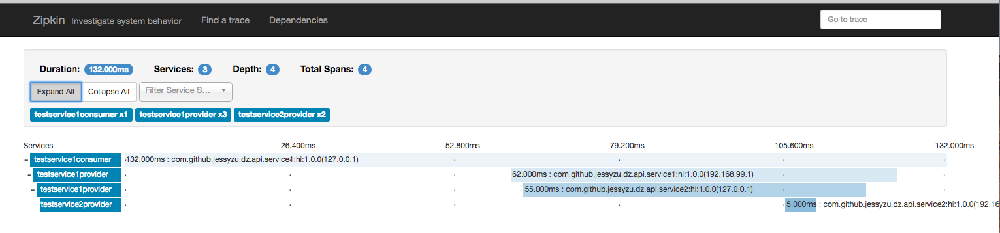
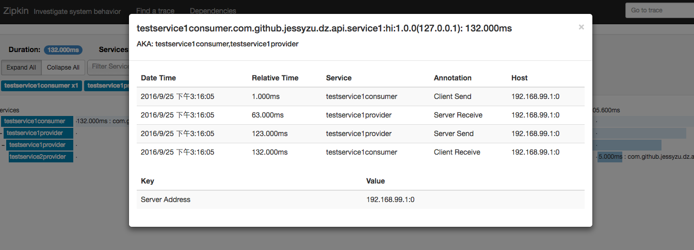

# dubbo-zipkin-spring-starter
Zipkin 是一款开源的分布式实时数据追踪系统（Distributed Tracking System）,此库是为国内著名服务治理框架的dubbo 编写的instument library,支持 dubbo调用的全链路实时调用数据统计与依赖分析追踪。使用者可以直接引入此boot starter，扩展默认自动激活。

##运行自带的测试例子
###1.下载zipkin数据收集服务器包 [zipkin-service-0.0.1-SNAPSHOT.jar](https://pan.baidu.com/s/1bpcG6gZ),这里以本地内存服务器做演示:

```
java ./zipkin-service-0.0.1-SNAPSHOT.jar

```
打开 [http://localhost:9411/](http://localhost:9411/)  页面

###2.按顺序分别运行Dubbo的服务调用与提供者

* 运行TestService2Provider.test()
* 运行TestService1Provider.test()
* 运行TestService1Consumer.test()


说明:

* 调用关系为TestService1Consumer->TestService1Provider->TestService2Provider;
* 一次调用会产生4个span，用来记录全链路的调用数据


###3.调用成功后，打开 [http://localhost:9411/](http://localhost:9411/)  页面，查询调用数据，如图：






###4.目前这个starter还未部署到maven中央仓库,后续会抽时间发布